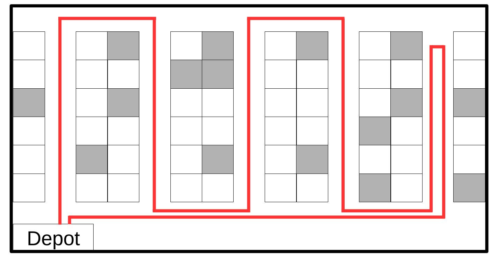

# Day 11

## Description
Remember me from Day 5 of the Advent? I'm the same manager at AmazOR.

This time I'm giving you a different problem. One of our daily operations in our warehouses 📦.

When receiving orders from our clients, pickers must go through the warehouse collecting all the products 🏃‍♂️. They start at the depot and finish at the depot too.

Instead of collecting order by order (which is inefficient 🐌), they group orders in batches so they collect several in the same trip 🛻.

At the end of the day, I'm responsible for doing the batches that pickers must retrieve the day after.

🔐 Things to consider:

Pickers cannot split orders, otherwise it’d be too hard to regroup products for the same order 🔒.
Each batch must fit into a pick cart, which has a certain capacity limit 🛒⚖️.
A single picker handles one batch 🚶.
Now, for the picking process...

Pickers use the S-Shape policy 🌀:

When they enter an aisle, they traverse it completely to its end 🛤️.

This way, they perform an S-shape path through the warehouse.

Like this:

While this is standard in our warehouses, we know we can do better.

Sometimes we’re in a hurry and cannot provide optimized batches 😅.

How can we improve the picking time for the sum of all the batches? 🧩

Here you can find an instance of this problem.

📢 Bonus Challenge:
How can we handle different policies for collecting the products? For example:

Largest gap policy (skip unneeded sections 🏃📏).
Combined policy (between S-Shape and Largest Gap policies).
⚠️ This is a difficult problem ⚠️

Remember this challenge is for you to document and share with others so you improve the way you think about optimization problems.

## Problem's data

* [instance.txt](./instance.txt)
* [description.txt](./description.txt)
* [description.pdf](./description.pdf)

## Notes

## Solution

## Output
