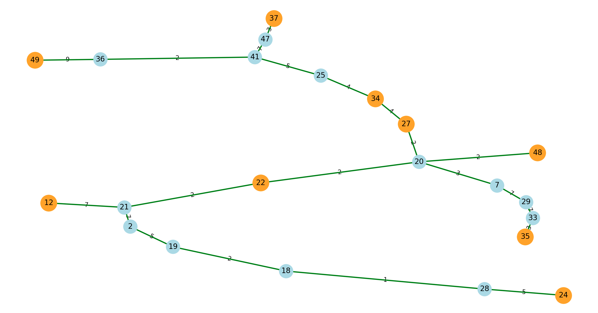

# Day 18 - call me! 


## Description
Hey, MORgan here, a network design consultant for 🌐 VerizOR.

My job is to ensure that we connect 📡 specific key locations (like cities, servers, or data centers) in the most cost-effective way possible.

However, we need to ensure that our connections form a network 🔗, and we want to minimize the total cost of laying cables 🛠️💵.

📋 Here’s what we know:

We have a bunch of nodes interconnected 🖧, and each connection has an associated cost (the expense of laying a cable between two nodes).
Some of the nodes are terminals 🔑, which must be connected together.
We can use other non-terminal vertices as intermediate connection points if necessary.
The goal is to find the minimum-cost subgraph that connects all terminal vertices directly or indirectly while satisfying the network constraint.

Can you help me solve this problem? 🧩

Let’s connect efficiently! 🌟

Here you can find an instance of this problem.

PS: if costs are close, how will you decide between multiple solutions?

## Problem's data

* [instance.txt](./instance.txt)

## Notes

## Solution
Using networkx, matplotlib

* [day18.py](./day18.py)

## Output
```
# nodes = 50
mandatory nodes = [48, 49, 22, 35, 27, 12, 37, 34, 24]
# edges = 63
Minimum spanning tree: [(2, 32, {'weight': 2}), (2, 19, {'weight': 5}), (2, 21, {'weight': 7}), (2, 8, {'weight': 8}), (21, 22, {'weight': 2}), (21, 17, {'weight': 5}), (21, 12, {'weight': 7}), (4, 36, {'weight': 6}), (5, 30, {'weight': 4}), (7, 20, {'weight': 3}), (7, 29, {'weight': 7}), (29, 9, {'weight': 5}), (29, 33, {'weight': 7}), (11, 3, {'weight': 7}), (11, 36, {'weight': 9}), (14, 20, {'weight': 7}), (14, 31, {'weight': 9}), (17, 42, {'weight': 6}), (17, 6, {'weight': 7}), (42, 46, {'weight': 10}), (18, 28, {'weight': 1}), (18, 43, {'weight': 1}), (18, 19, {'weight': 2}), (28, 45, {'weight': 1}), (28, 24, {'weight': 5}), (20, 27, {'weight': 2}), (20, 48, {'weight': 2}), (20, 22, {'weight': 2}), (20, 38, {'weight': 8}), (16, 30, {'weight': 2}), (27, 34, {'weight': 4}), (40, 23, {'weight': 3}), (40, 22, {'weight': 8}), (22, 10, {'weight': 6}), (25, 34, {'weight': 4}), (25, 41, {'weight': 5}), (34, 30, {'weight': 2}), (33, 35, {'weight': 3}), (30, 15, {'weight': 1}), (36, 41, {'weight': 2}), (36, 39, {'weight': 7}), (36, 49, {'weight': 9}), (36, 50, {'weight': 10}), (39, 44, {'weight': 3}), (50, 13, {'weight': 1}), (41, 1, {'weight': 5}), (41, 47, {'weight': 7}), (47, 37, {'weight': 3}), (45, 26, {'weight': 6})]
Total cost: 238
Leaves that will be removed: [1, 3, 4, 5, 6, 8, 9, 10, 13, 15, 16, 23, 26, 31, 32, 38, 43, 44, 46]
total cost at step 1: 144
Leaves that will be removed: [11, 14, 30, 39, 40, 42, 45, 50]
total cost at step 2: 94
Leaves that will be removed: [17]
total cost at step 3: 89
```

